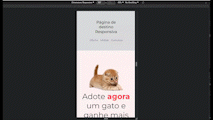

# Página de Destino Responsiva

Este é o projeto do terceiro dia do desafio "100 Days of Code". O objetivo é criar uma página de destino responsiva usando HTML e CSS. A página contém várias seções, como oferta, mídias e contatos.

## Demonstração

## Características

- Página responsiva que se adapta a diferentes tamanhos de tela.
- Menu de navegação que permite acesso rápido às diferentes seções.
- Seção de oferta com uma imagem atraente e informações relevantes.
- Seção de mídias com imagens de gatos em destaque.
- Seção de contatos com links para redes sociais e outras informações de contato.
- Rodapé com informações do desenvolvedor e direitos reservados.

## Tecnologias Utilizadas

- HTML
- CSS

## Instruções de Uso

1. Clone este repositório em seu ambiente de desenvolvimento.
2. Abra o arquivo `index.html` em seu navegador.
3. A página será exibida, e você pode navegar pelas diferentes seções usando o menu de navegação.

## Estrutura do Projeto

- `index.html`: Arquivo HTML principal que contém a estrutura da página.
- `style.css`: Arquivo CSS que define o estilo da página.

## Contribuição

Contribuições são bem-vindas! Sinta-se à vontade para abrir um problema ou enviar uma solicitação pull para melhorias.
